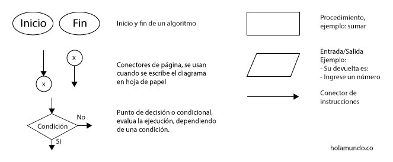
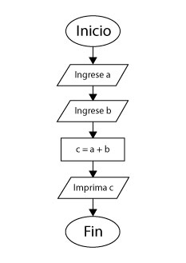
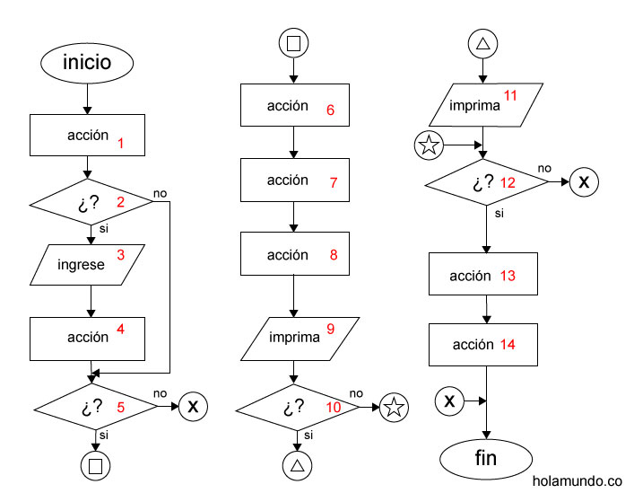

# Diagramas de flujo

## ¿Qué son los diagramas de flujo?

Es la visualización gráfica de el pseudocódigo

## ¿Cómo se crea un diagrama de flujo?

Para crear el diagrama de flujo, se recomienda primero realizar el pseudocódigo, de esta manera va a ser mucho más fácil interpretar en símbolos la solución. La solución gráfica permite una mejor comprensión de la solución y del problema, se puede validar la solución y en caso de encontrar algún error volver al pseudocódigo para ajustar la solución. De esta manera se evitan errores antes de realizar el programa.

Para crear el diagrama se deben usar los siguientes símbolos:

### Ejemplo

Diagrama suma de dos números

## Ejercicio

¿Cuantos caminos posibles hay en el siguiente diagrama de flujo? recuerde que debe ser posible ir desde el inicio hasta el fin.

Ejemplo primer camino: `1,2,3,4,5`

